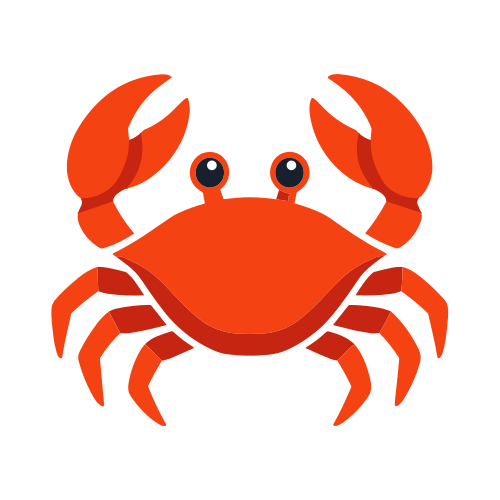

<div align="center">
  
  <h1>Crab Watch</h1>
  <p><strong>Post-game chess forensics for Chess.com.</strong></p>
  <p>Look at the game, then look at the history around it.</p>
</div>

---

Crab Watch is a Chrome extension for reviewing completed Chess.com games in context. It looks beyond a single engine score and brings together recent game history, position difficulty, move timing, repeated decisions, historical strength, personal engine behavior, and other signals that can make a game worth a closer look.

It is deliberately a **review tool, not a verdict machine**. An unusual game is not automatically proof of outside assistance, and Crab Watch does not pretend that one metric can settle that question.

## What Crab Watch does

### 🦀 Post-game only

Crab Watch does not analyze positions, recommend moves, or run an engine while a human-vs-human game is in progress. The forensic review starts after the game is finished.

### 📚 Puts the game in context

The review can use up to **351 recent public games** from Chess.com's read-only PubAPI. The newest **300 games** form the main behavioral window, while the additional games provide broader account context.

### ♟️ Looks for meaningful decisions

The analysis reconstructs chess positions from PGN and can identify:

- critical decision points
- difficult or tactically sharp positions
- exact repeated position-and-move decisions
- similar decisions across earlier games
- changes in playing patterns over time
- move-timing patterns when clock data is available

### ⚙️ Uses Stockfish carefully

Stockfish 18 is bundled with the extension and runs in a browser worker after the game is complete. It is used on selected critical positions rather than turning every historical game into a giant engine sweep.

Crab Watch also builds a small personal engine baseline from recent games. That matters because a player's own normal performance is more useful context than comparing everyone against the same generic expectation.

### 🔎 Keeps evidence separate

The review keeps different signals distinct instead of flattening everything into one suspiciousness score. Engine agreement, timing, historical strength, repeated decisions, change points, position difficulty, and account context are treated as different pieces of evidence.

There is intentionally **no fake cheating percentage**. A meaningful probability requires a properly labeled evaluation corpus containing both clean games and confirmed cases. Until that exists, Crab Watch reports evidence and uncertainty rather than inventing precision.

## Current release

**0.11.0 Beta**

The current beta includes the post-game review pipeline, recent-history collection, PGN position reconstruction, critical-position selection, timing analysis, Stockfish 18 analysis, personal engine baselines, similar-position matching, change-point detection, and evidence fusion.

The project is still being hardened. The goal is to make every signal more useful and more defensible before attempting any calibrated classification.

## Install locally

The easiest way to test the beta right now is to load the extension into Chrome as an unpacked extension.

### 1. Get the source

Open the repository on GitHub and choose **Code → Download ZIP**, then extract it somewhere convenient.

> The normal GitHub source download is not the same thing as the finished Chrome Web Store package. The repository contains the source and build files. The release ZIP is produced by the packaging script after the bundled Stockfish files and store icons have been prepared.

### 2. Build the extension package

From the extracted project folder, open a terminal and run:

```bash
npm install
npm run vendor:stockfish
npm run package:extension
```

That produces:

```text
crab-watch-v0.11.0.zip
```

The packaging step also generates the Chrome extension PNG icons from the original `assets/crab.svg` artwork.

### 3. Load it into Chrome

For the quickest local smoke test, use the generated `dist/` folder rather than installing from the ZIP:

1. Open `chrome://extensions`.
2. Turn on **Developer mode**.
3. Click **Load unpacked**.
4. Select the project's `dist/` folder.
5. Open the extension details and make sure Crab Watch is enabled.

After changing source files, rerun the package command and use **Reload** on the extension in `chrome://extensions`.

### 4. Run a real post-game test

Play or open a game that has already finished on Chess.com. Then open Crab Watch and request the forensic review.

A healthy local build should be able to:

- recognize the completed game
- identify the opponent
- retrieve recent public history when available
- reconstruct the completed game's positions
- identify critical positions
- read clock annotations when the PGN includes them
- run the bundled Stockfish analysis after completion
- show the personal baseline and history/context sections
- save the completed review locally

If a particular signal has no usable data, the extension should say so rather than manufacture a result.

## For development

Run the unit test suite with:

```bash
npm test
```

Run the release validation gate with:

```bash
npm run validate:release
```

Build the complete extension package with:

```bash
npm run package:extension
```

The repository's GitHub Actions workflow runs the tests, vendors Stockfish, validates the release files, builds the package, and checks that the expected engine and icon assets are present.

## API behavior

Crab Watch uses Chess.com's public, read-only game data and caches collected history locally. Archive requests are made conservatively and reused for a period of time instead of hammering the API with parallel requests.

## Design philosophy

Crab Watch is intentionally quiet. No glowing fake telemetry, no giant "CHEATER DETECTED" badge, and no pretending that an engine line is a complete explanation of human behavior.

The interesting part is the context around a move: what the position demanded, how the player normally behaves, how much time was available, what similar decisions looked like before, and whether the current game actually stands out from that baseline.

## Roadmap

The next areas of work are focused on making the analysis deeper without making it reckless:

1. stronger completed-game ingestion and PGN validation
2. richer similar-position matching
3. player-specific error signatures
4. stronger historical-strength modeling
5. more robust change-point detection
6. cross-game anomaly clustering
7. multi-engine and multi-depth agreement
8. calibrated evidence fusion once a trustworthy labeled corpus exists
9. cleaner human-readable review reports

## Important limitation

Crab Watch does not and should not claim that a single game proves cheating. Fast moves, high engine agreement, repeated openings, rating changes, a large account history, or any other individual signal can have innocent explanations.

The project's job is to make the evidence easier to inspect, not to turn uncertainty into a confident-looking number.

## License

See the repository for the current project license and dependency notices.
